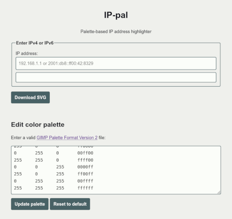

# IP-pal

Highlight IP addresses (IPv4 and IPv6) using a color palette.

## Screenshot

## License and credits

This software is distributed under the [MIT License](LICENSE).

Idea by [Mesa](https://mesaoptimizer.com/).

The default [Windows 95 256-color palette](https://lospec.com/palette-list/windows-95-256-colours) was reconstructed by Mathew Eis and shared by Chris Moes.
Despite a `.gpl` extension, palettes are not generally considered copyrightable.
